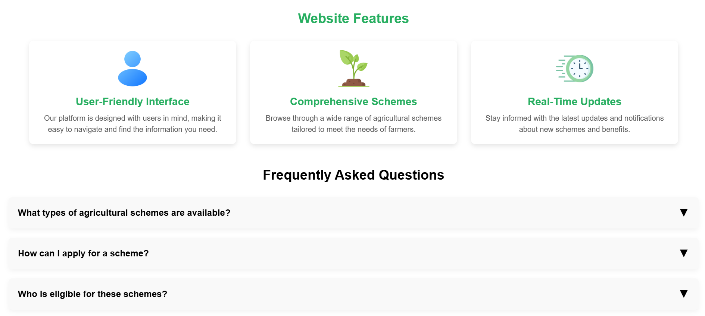

# KRUSHI-MITRA





KRUSHI-MITRA is a web platform dedicated to empowering farmers, students, small businesses, and nonprofit organizations by simplifying access to government schemes. The platform serves as a bridge to financial aid and welfare opportunities, providing personalized guidance and up-to-date resources. By fostering inclusivity and innovation, KRUSHI-MITR aims to create a meaningful impact on diverse communities.

## Key Objectives

- **Empowerment**: Facilitate access to government schemes for underserved communities.
- **Awareness**: Educate users about various opportunities available for financial and social welfare.
- **Efficiency**: Simplify the process of discovering, understanding, and applying for schemes.

## Core Features

### Personalized Scheme Recommendations
KRUSHI-MITRA uses user inputs to suggest government schemes tailored to their specific needs, ensuring relevance and usefulness.

### Simplified Navigation
The platform offers an intuitive interface, making it easy for users to browse through various schemes and resources without technical expertise.

### Up-to-date Resources
By maintaining current information on available schemes, KRUSHI-MITRA ensures users stay informed about the latest opportunities.

### Interactive Design
The website includes engaging features, such as a rotating logo animation on hover, enhancing user experience and visual appeal.

### Student Planner
A specialized section provides tools for students to organize tasks, manage time effectively, and achieve academic goals.

## Technology Stack

- **Frontend**: Built using React.js for a dynamic and responsive user interface.
- **Backend**: Powered by Appwrite for secure and scalable data management.
- **Styling**: Organized CSS within a modular `styles` folder for maintainability and efficiency.

## Deployment

KRUSHI-MITRA is deployed on Vercel and can be accessed at:

[https://krushi-mitra-web.vercel.app/](https://krushi-mitra-web.vercel.app/)

## Getting Started

To set up KRUSHI-MITRA locally:

### Prerequisites

- **Node.js**: Ensure Node.js is installed.
- **Appwrite Account**: Create an Appwrite account for backend configurations.

### Installation Steps

1. **Clone the Repository**:
   ```bash
   git clone https://github.com/yourusername/krushi-mitra.git
   cd krushi-mitra
   ```

2. **Install Dependencies**:
   ```bash
   npm install
   ```

3. **Set Environment Variables**:
   - Create a `.env` file in the root directory.
   - Add Appwrite configurations such as API endpoint, project ID, and secret key.

4. **Run the Development Server**:
   ```bash
   npm start
   ```

5. **Access the Application**:
   Open [http://localhost:3000](http://localhost:3000) in your browser.

## Usage Guide

### For Farmers
- Input personal and land details to receive curated government schemes.
- Explore schemes categorized for agricultural development, financial aid, and more.

### For Students
- Utilize the student planner for effective task management and study organization.

### For Small Businesses and Nonprofits
- Browse schemes aimed at boosting small businesses and supporting nonprofit initiatives.

## Future Enhancements

- **Voice Interaction**: Enable voice-based commands for accessibility.
- **Advanced Analytics**: Provide insights into the most popular schemes and user engagement metrics.
- **Expanded Coverage**: Include additional resources such as agricultural techniques, business tools, and training modules.
- **Mobile App**: Develop a mobile application for on-the-go access.

## Contribution Guidelines

KRUSHI-MITRA thrives on community contributions. To contribute:

1. **Fork the Repository**.
2. **Create a Feature Branch**:
   ```bash
   git checkout -b feature-name
   ```
3. **Make Your Changes** and commit them:
   ```bash
   git commit -m "Description of changes"
   ```
4. **Push to Your Branch**:
   ```bash
   git push origin feature-name
   ```
5. **Submit a Pull Request** for review.

## Acknowledgments

We extend our gratitude to all contributors and supporters of KRUSHI-MITRA. Together, we can make a difference!
